# K12 AI智能阅卷系统可视化图表

## 1. 系统架构总览图

### 1.1 功能模块架构图

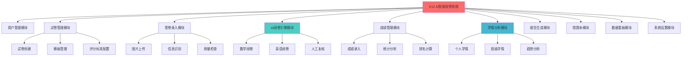

### 1.2 前端页面层级架构图

```mermaid
graph TB
    A[系统主框架] --> B[工作台首页]
    A --> C[试卷管理]
    A --> D[阅卷中心]
    A --> E[成绩管理]
    A --> F[学情分析]
    A --> G[班级管理]
    A --> H[系统设置]
    
    B --> B1[数据概览]
    B --> B2[快捷操作]
    B --> B3[近期动态]
    
    C --> C1[试卷列表]
    C --> C2[试卷创建]
    C --> C3[试卷编辑]
    C --> C4[试卷预览]
    
    D --> D1[阅卷任务列表]
    D --> D2[答卷上传]
    D --> D3[AI阅卷工作台]
    D --> D4[人工复核]
    
    E --> E1[成绩总览]
    E --> E2[成绩详情]
    E --> E3[学生成绩详情]
    
    F --> F1[分析首页]
    F --> F2[个人学情分析]
    F --> F3[班级学情分析]
    F --> F4[知识点分析]
    
    G --> G1[班级列表]
    G --> G2[班级详情]
    G --> G3[学生信息管理]
    
    H --> H1[个人设置]
    H --> H2[评分标准配置]
    H --> H3[系统管理]
    
    style A fill:#ff6b6b
    style C fill:#4ecdc4
    style D fill:#45b7d1
    style F fill:#96ceb4
```

## 2. 核心业务流程图

### 2.1 完整阅卷业务流程

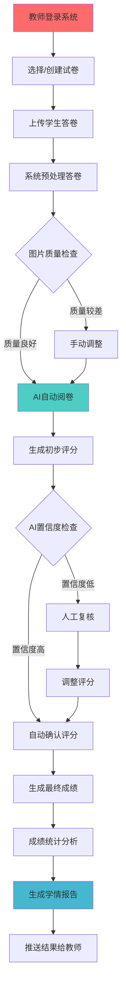

### 2.2 AI阅卷详细流程

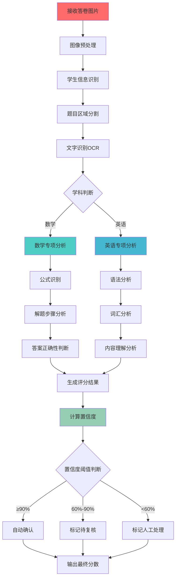

## 3. 用户操作路径图

### 3.1 新手教师首次使用流程

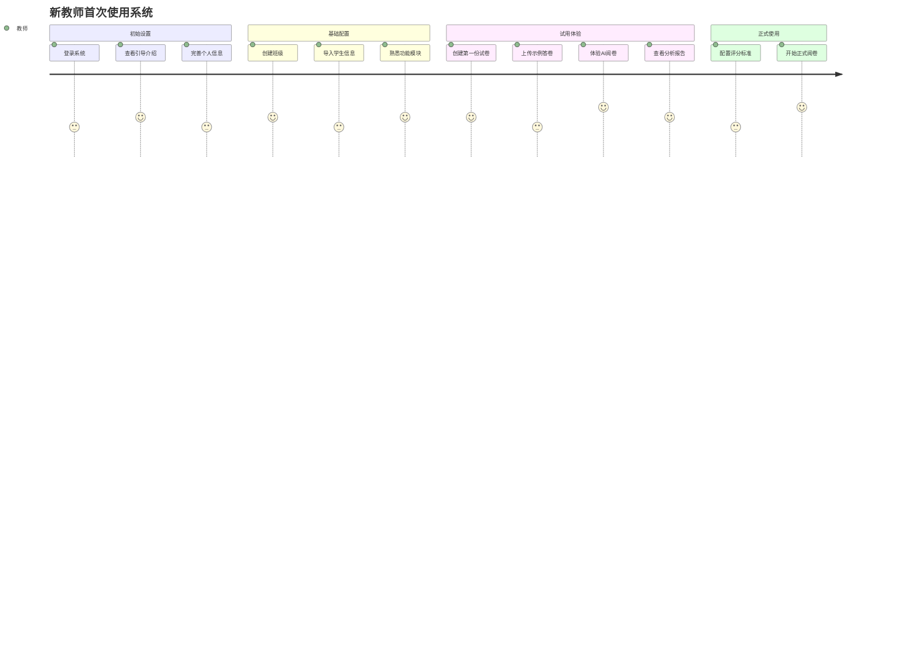

### 3.2 期中考试阅卷操作路径

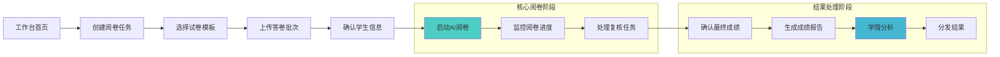

## 4. 页面跳转导航图

### 4.1 主要页面间跳转关系

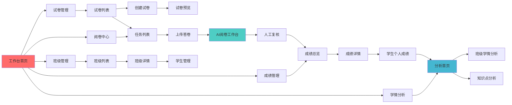

### 4.2 快捷跳转路径

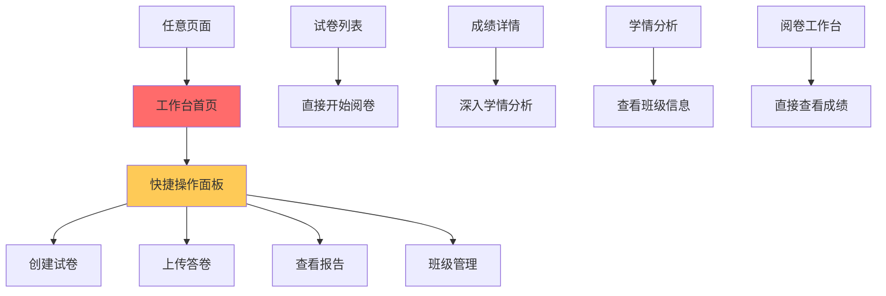

## 5. 数据流向图

### 5.1 系统数据流转

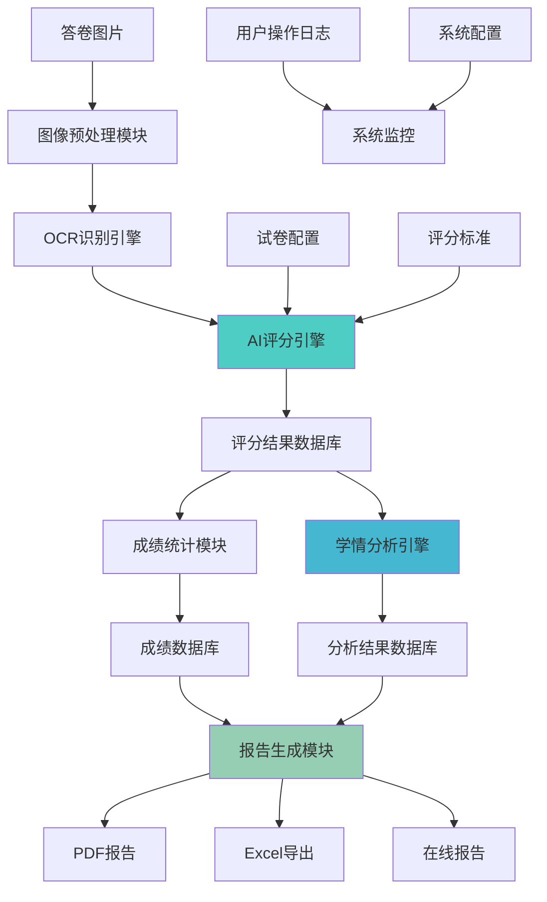

### 5.2 用户权限和数据安全

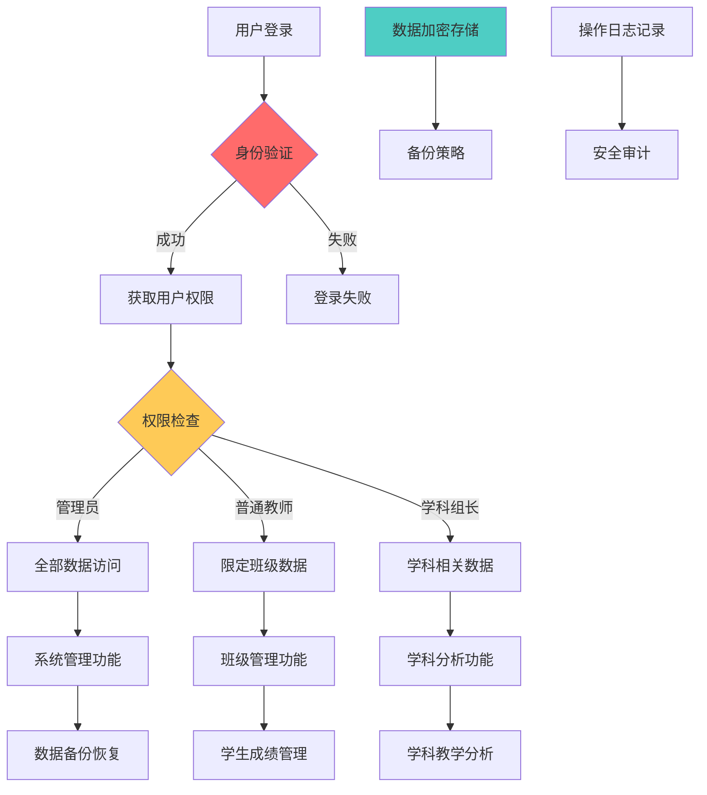

## 6. 移动端适配设计

### 6.1 移动端页面简化流程

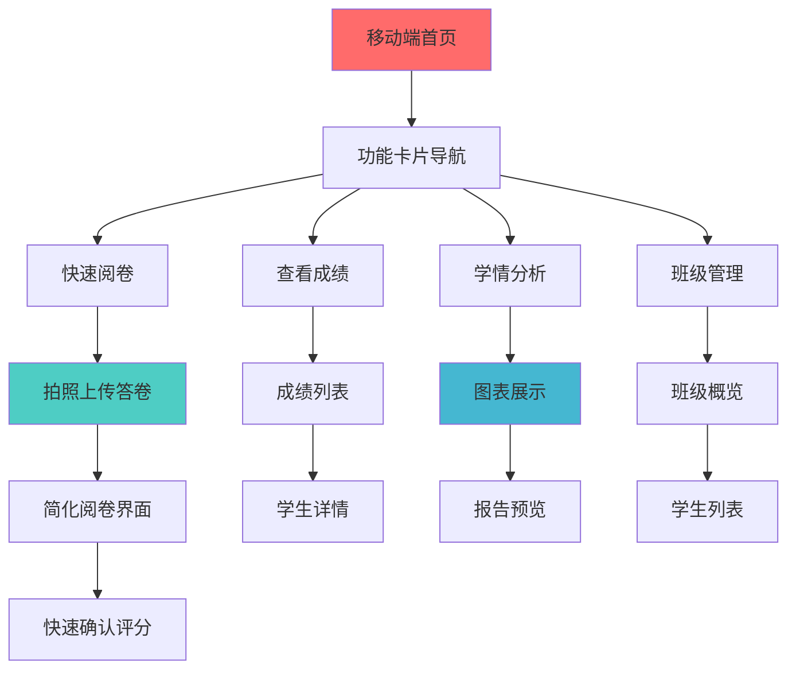

## 7. 系统性能监控图表

### 7.1 关键性能指标监控

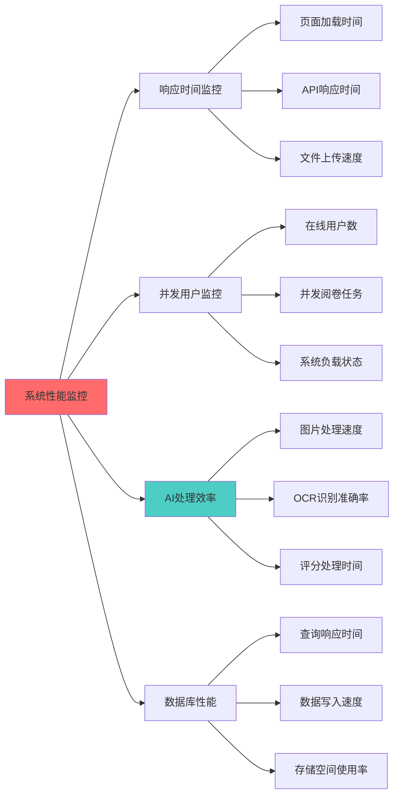

---

## 图表使用说明

### Mermaid图表渲染
以上所有图表均使用Mermaid语法编写，可以在支持Mermaid的环境中直接渲染显示，包括：

- GitHub/GitLab
- VS Code (with Mermaid extension)
- 各类支持Mermaid的Markdown编辑器
- 在线Mermaid编辑器 (https://mermaid.live/)

### 图表颜色说明
- **红色 (#ff6b6b)**：核心入口和关键节点
- **青色 (#4ecdc4)**：AI处理相关功能
- **蓝色 (#45b7d1)**：数据分析相关功能  
- **绿色 (#96ceb4)**：报告生成相关功能
- **黄色 (#feca57)**：用户交互和权限相关

---

**文档版本**：v1.0  
**创建时间**：2025-08-03  
**工具要求**：支持Mermaid语法的Markdown渲染器